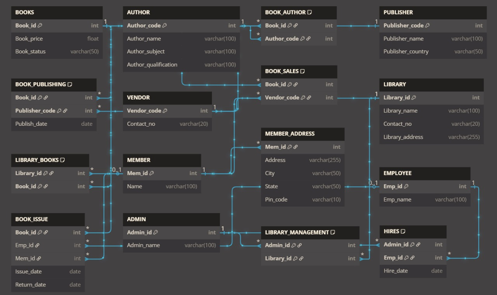

# Library Management System

## Overview
This is a Java-based Library Management System that uses a client-server architecture and MySQL as the backend database. The system allows different roles (Member, Vendor, Admin, Author, Publisher) to interact with the library, manage books, handle requests, and perform searches.

## Features
- **Member:** View book status, request and return books.
- **Vendor:** View all books, add sales.
- **Admin:** Add/delete books, view members, hire employees, add members, view all books.
- **Author/Publisher:** View books by author or publisher.
- **Search:** Search books by Book ID, Author ID, or Publisher ID.

## Project overview
### 🗺️ ER Diagram

### Client-Server Interface

## Project Structure
library_management/
  client/           # Client-side application
  server/           # Server-side application
  db/               # Database connection handler
  utils/            # Query and business logic handler
  config.properties # Database configuration and passkeys

## Prerequisites
- Java 8 or above
- MySQL Server
- MySQL JDBC Driver (mysql-connector-java)

## Database Setup
1. Create a MySQL database named library_management.
2. Set up the required tables (BOOKS, MEMBER, ADMIN, EMPLOYEE, BOOK_REQUEST, BOOK_ISSUE, HIRES, etc.).
3. Update config.properties with your MySQL credentials:
   
   db.url=jdbc:mysql://localhost:3306/DB_NAME
   db.user=YOUR_DB_USER
   db.password=YOUR_DB_PASSWORD

## Configuration
- The config.properties file contains the database connection details. Ensure this file is correctly set up before running the server.

## How to Run
1. **Start the Server:**
   - Compile all Java files if not already compiled.
   - Run the server:
     
java library_management.server.Server

2. **Start the Client:**
   - In a new terminal, run:
     
java library_management.client.Client

3. **Interact:**
   - Follow the on-screen menu to interact as Member, Vendor, Admin, Author, Publisher, or perform searches.

## Contribution
1. Fork the repository.
2. Create a new branch for your feature or bugfix.
3. Commit your changes with clear messages.
4. Open a pull request.

## License
This project is for educational purposes. You’re free to study and modify the code for academic or personal learning purposes.
